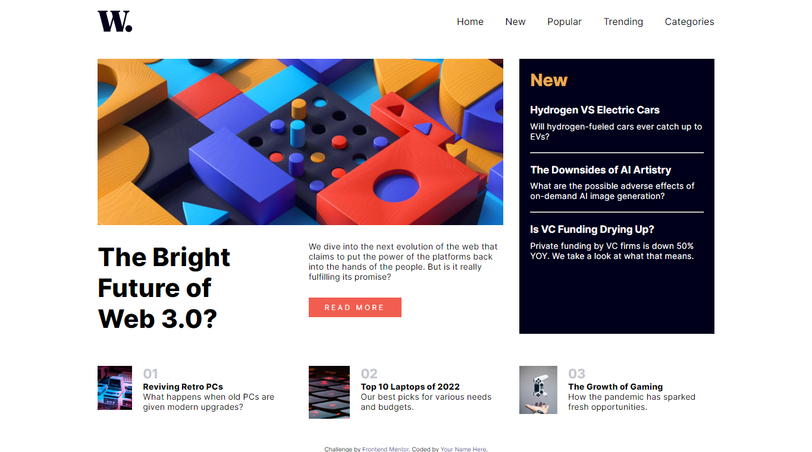
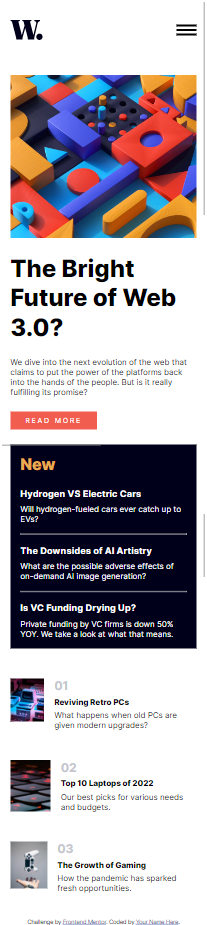
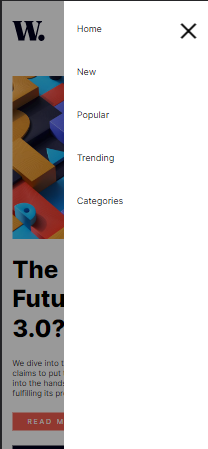

# Frontend Mentor - News homepage solution

This is a solution to the [News homepage challenge on Frontend Mentor](https://www.frontendmentor.io/challenges/news-homepage-H6SWTa1MFl). Frontend Mentor challenges help you improve your coding skills by building realistic projects. 

## Table of contents

- [Overview](#overview)
  - [The challenge](#the-challenge)
  - [Screenshot](#screenshot)
  - [Links](#links)
- [My process](#my-process)
  - [Built with](#built-with)
  - [What I learned](#what-i-learned)
  - [Continued development](#continued-development)
- [Author](#author)

## Overview

### The challenge

Users should be able to:

- View the optimal layout for the interface depending on their device's screen size
- See hover and focus states for all interactive elements on the page

### Screenshot

### Links

- Solution URL: [Add solution URL here](https://your-solution-url.com)
- Live Site URL: [Add live site URL here](https://your-live-site-url.com)

## My process

### Built with

- HTML5
- CSS custom properties
- CSS Flexbox
- CSS Grid

### What I learned

This project taught me how to properly implement the hamburger on mobile devices. I was having
having issues implementing the shadow that come with the mobile menu, but with some help from a 
friend, I finally got it done.

This project also helped me improve mt knowledge of CSS grid, and re-ordering elements in 
grip container.

### Continued development

- ReactJS
- Build more projects using react
- Build my portfolio website

## Author

- Frontend Mentor - [@Drew-Adeleye](https://www.frontendmentor.io/profile/Drew-Adeleye)
- Twitter - [@_Andrewiiii](https://www.twitter.com/yourusername)
- GitHub - [@Drew-Adeleye](https://github.com/Drew-Adeleye)

